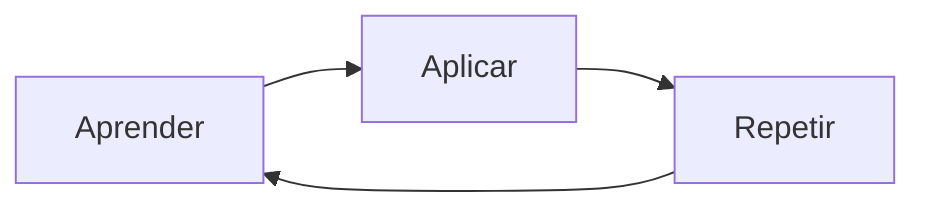

# 📖 Capítulo 1: O Pragmático

## Overview

Este capítulo estabelece a fundação filosófica do programador pragmático. Define a diferença entre um programador comum e um pragmático através de princípios fundamentais.

## Princípios Fundamentais

### 1. **Conhecimento como Investimento 💰**

> "Você investe em seu conhecimento. Quanto mais você sabe, mais valioso se torna."

- O conhecimento é um ativo que se valoriza com o tempo
- Aprender continuamente é essencial
- Não tenha medo de perguntar e investigar

### 2. **Curiosidade Sistêmica 🔍**

- Entenda como as coisas funcionam
- Não aceite respostas superficiais
- Investigue a causa raiz dos problemas
- O mundo é um sistema de processamento de informações

### 3. **Comunicação Efetiva 💬**

> "A comunicação é a chave do sucesso em qualquer projeto."

- Explique suas ideias claramente
- Escute atentamente os outros
- Documente suas decisões
- Adapte sua linguagem ao público

### 4. **Responsabilidade e Propriedade 🎯**

- Assuma responsabilidade pelo seu código
- Não culpe as ferramentas ou o sistema
- Esteja disposto a admitir erros
- Traga soluções, não apenas problemas

## O Ciclo de Aprendizagem de Dewey

O aprendizado é um ciclo contínuo:
1. **Aprenda** - Estude conceitos e técnicas
2. **Aplique** - Use em situações reais
3. **Repita** - Refine e melhe constantemente

## Hábitos do Programador Pragmático

### ✅ O que fazer

- Mantenha um [[resiliencia-e-flexibilidade]] mindset
- Use ferramentas de forma eficiente
- Escreva código auto-documentado
- Automatize tarefas repetitivas
- Pense a longo prazo

### ❌ O que evitar

- Procrastinar decisões difíceis
- Depender de "coisas mágicas"
- Ignorar problemas técnicos
- Resistir a mudanças
- Duplicar conhecimento

## A Metáfora do Robo

> "Um programador pragmático é como um robô que pode reprogramar a si mesmo."

Este conceito é crucial porque:
- Robôs executam tarefas sem reclamar
- Podem ser atualizados e melhorados
- Seguem instruções consistentemente
- Funcionam em diversos ambientes

## Sua Viagem: Um Robo do Conhecimento

### Estágios de Desenvolvimento

| Estágio | Descrição | Práticas |
|---------|-----------|----------|
| **Aprendiz** | Absorvendo conhecimento | Ler, estudar, perguntar |
| **Praticante** | Aplicando o aprendido | Codificar, experimentar, errar |
| **Mestre** | Compartilhando sabedoria | Ensinar, liderar, inovar |

## Citáveis do Capítulo

> [!quote]
> "Não é o que você sabe que importa. É o que você consegue descobrir."
>
> — *Programador Pragmático*

> [!quote]
> "A pergunta mais importante que você pode fazer é: 'Por que não está funcionando?'"
>
> — *Programador Pragmático*

## Exercícios Práticos

### 🎯 Tarefas para aplicar o aprendizado

- [ ] Identifique uma área de conhecimento que deseja melhorar
- [ ] Crie um plano de aprendizagem com 3 etapas
- [ ] Implemente uma pequena automação no seu dia a dia
- [ ] Documente uma decisão técnica complexa que você tomou
- [ ] Ensine algo que você aprendeu recentemente

## Conceitos Relacionados

- [[pragmatismo]] - Filosofia central do livro
- [[ciclo-de-aprendizagem]] - Dewey's Learning Cycle
- [[responsabilidade-pessoal]] - Ownership do código
- [[comunicacao-efetiva]] - Habilidade essencial

## Notas Pessoais

> [!note]
> Este capítulo estabelece a mentalidade base. Os próximos capítulos detalham práticas específicas baseadas nestes princípios.

## Próximo Capítulo

→ [[capitulo-02-manejando-grep]]

---

**Data da leitura:** 2026-01-26
**Tags principais:** `#mentalidade` `#filosofia` `#fundamentos`
